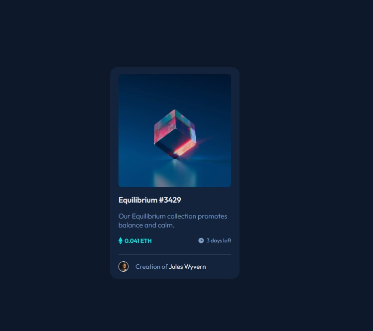

# Frontend Mentor - NFT preview card component solution 

# Welcome! 👋

## Table of contents

- [Overview](#overview)
  - [The challenge](#the-challenge)
  - [Screenshot](#screenshot)
  - [Links](#links)
- [My process](#my-process)
  - [Built with](#built-with)
  - [What I learned](#what-i-learned)
  - [Continued development](#continued-development)
  - [Useful resources](#useful-resources)
- [Author](#author)
- [Acknowledgments](#acknowledgments)

## Overview

### The challenge

Your challenge is to build out this preview card component and get it looking as close to the design as possible.

You can use any tools you like to help you complete the challenge. So if you've got something you'd like to practice, feel free to give it a go.

Your users should be able to:

- View the optimal layout depending on their device's screen size
- See hover states for interactive elements

### Screenshot

### Links

- Solution URL: [Add solution URL here](https://your-solution-url.com)
- Live Site URL: [Add live site URL here](https://your-live-site-url.com)

## My process

### Built with

- Semantic HTML5 markup
- CSS custom properties
- Flexbox
- Pseudoclass
- Positioning

### What I learned

During this project, i learnt more on how tomuse flexbox and positioning in css. And i was able to replicate the design with responsiveness.

### Continued development

- Layout Responsiveness.

## Author

- Github - [Oyeyemiwole19](https://github.com/Oyeyemiwole19)
- Frontend Mentor - [@yourusername](https://www.frontendmentor.io/profile/Oyeyemiwole19)
- Twitter - [@wole_adekunle1]()

**Thanks!** 🚀